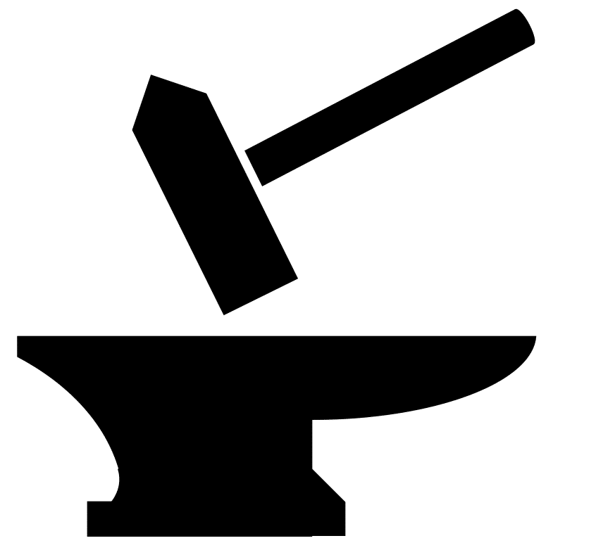
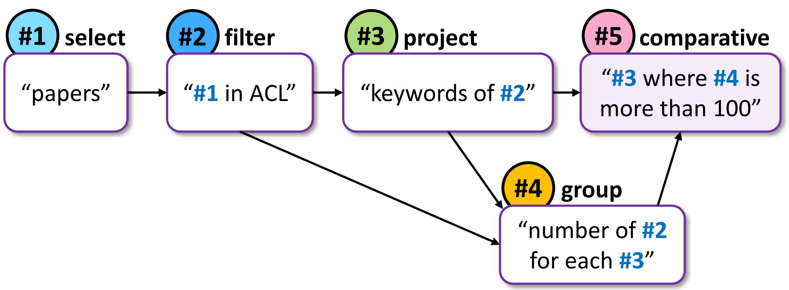

<p float="left">
  
  <a href="https://allenai.org/">
    
  </a>
  <a href="https://www.tau-nlp.org/">
    
  </a>
</p>

## **A Question Understanding Benchmark**

Released February 2020.  
See our blogpost at: <a href="somelink">some link</a>.  

<div class="card">
  
  <div class="container">
    <h4><b>John Doe</b></h4> 
    <p>Architect & Engineer</p> 
  </div>
</div>

1. [x] Merit number one
2. [X] Merit number two

Contains questions over modality 1 from <a href="somelink">**Dataset1**</a>, <a href="somelink">**Dataset1**</a>, <a href="somelink">**Dataset1**</a> and <a href="somelink">**Dataset1**</a>.  
Contains questions over modality 2 from <a href="somelink">**Dataset1**</a>, <a href="somelink">**Dataset1**</a>, <a href="somelink">**Dataset1**</a> and <a href="somelink">**Dataset1**</a>.  
Contains questions over modality 3 from <a href="somelink">**Dataset1**</a>, <a href="somelink">**Dataset1**</a>, <a href="somelink">**Dataset1**</a> and <a href="somelink">**Dataset1**</a>.  




## **Paper**


<a href="https://arxiv.org/">
  **Paper Name**  
</a>
*Authors List*  
Publication Venue 2020  

```markdown
@inproceedings{some2020paper,
  title={Paper Title},
  author={FirstName1, LastName1 and FirstName2, LastName2 and FirstName3, LastName3 and FirstName4, LastName4 and FirstName5, LastName5 and FirstName6, LastName6 and FirstName7, LastName7},
  booktitle={The Journal},
  year={2020}
}
```

## **Authors**

> Talent wins games,  
> but teamwork and intelligence wins championships.

*Michael Jordan*


  |    |    |    |    |    |  
:-------------------------:|:-------------------------:|:-------------------------:|:-------------------------:|:-------------------------:|:-------------------------:|:-------------------------:
Author1             |  Author2  |  Author3  |  Author4  |  Author5  |  Author6  |  Author7


## **Leaderboard**

### **Submission**
Official Leaderboard submission.

### **Results**

Rank | Submission | Created | EM Dev. | EM Test
------------ | ------------- | ------------- | ------------- | -------------
1 | First Model | First Model | `00.00`  | `00.00`
2 | Second Model | Second Model | `00.00`  | `00.00` 
