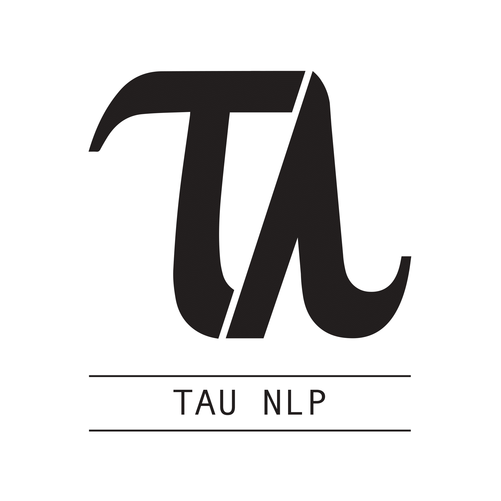

<p float="left">
  
  <a href="https://allenai.org/">
    
  </a>
  <a href="https://www.tau-nlp.org/">
    
  </a>
</p>

## **A Question Understanding Benchmark**

Released February 2020.


## **Paper**

```markdown
Syntax highlighted code block
```

## **Authors**

> Talent wins games,
> but teamwork and intelligence wins championships.

*Michael Jordan* :goat: :basketball:

First Header | Second Autor | Third Autor | Fourth Autor | Fifth Autor | Sixth Autor | Seventh Autor 
------------ | ------------- | ------------- | ------------- | ------------- | ------------- | -------------
First Image | Second Image | Second Image | Second Image | Second Image | Second Image | Second Image


### **Markdown**

Markdown is a lightweight and easy-to-use syntax for styling your writing. It includes conventions for

```markdown
Paper bib citation
```

# Header 1
## Header 2
### Header 3

- Bulleted
- List

1. Numbered
2. List

**Bold** and _Italic_ and `Code` text

[Link](url) and 
```

For more details see [GitHub Flavored Markdown](https://guides.github.com/features/mastering-markdown/).

### Jekyll Themes

Your Pages site will use the layout and styles from the Jekyll theme you have selected in your [repository settings](https://github.com/tomerwolgithub/BreakWeb/settings). The name of this theme is saved in the Jekyll `_config.yml` configuration file.

### Support or Contact

Having trouble with Pages? Check out our [documentation](https://help.github.com/categories/github-pages-basics/) or [contact support](https://github.com/contact) and we’ll help you sort it out.
